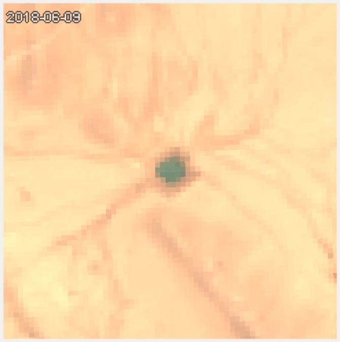

  

# Jordan Water Harvesting Site Monitoring
I work as a GIS specialist for the Macaulay Lab at UC. I am currently contracted through August to help develop the Water Harvesting Training portion of the larger training program called ArcGIS Collector, Survey123, Avenza Maps, and Google Earth Engine Water Harvesting and Rangeland Management in Jordan. The Water Harvesting Training focuses on teaching basic GIS data management and introductory Google Earth Engine coding skills to employees of the Jordan Ministry of Agriculture in the Rangeland Management Directorate.

I am also scripting a time series analysis to track the presence of water with the Net Difference Water Index (NDWI) while controlling for cloudy pixel using Landsat 8 imagery. The final scripts will run the analysis for all 100+ water harvesting sites and generate graphs for each site fitted with a harmonic regression to explore the seasonality of each site. This is not a part of the training modules, but it is in hopes to demonstrate the insightfulness of remote sensing to encourage employees and the Directorate to incorporate remotely sensed information into water harvesting sites maintenance, repair, and planning decisions.

If time permits, I am working on a user interface layout in GEE with Google's user interface API to package the training module material and time series analysis for individual sites in an easier to use format for employees that struggle with coding. The user interface format would also have extendable applications as a tool to monitor any water feature in a remote area for landscape managers.

I also provide support for the ArcGIS Collector and Survey123 portions of the program.

# Training Outline
The training for monitoring water harvesting sites with Google Earth Engine (GEE) has three modules.

1. Data Management
    * The Data Management training module teaches employees how to take the Excel files they already have, properly format them to convert into shapefiles, and how to load those shapefiles into GEE.

2. Introduction to GEE
    * The Introduction to GEE training module covers how to vector and raster data in GEE, display both types of data on the map, and subset datasets to features or scenes of interest.

3. NDWI
    * The NDWI training module will venture into immediate GIS knowledge and GEE skills. The NDWI training module starts by brushing on the concept of spectral vegetation indices to introduce NDWI as an index of water. It then covers how to generate charts in GEE using map() and reducer functions().

# Repository
This repository holds the code for the three training modules, the time series analysis, and the preliminary user interface tool.
